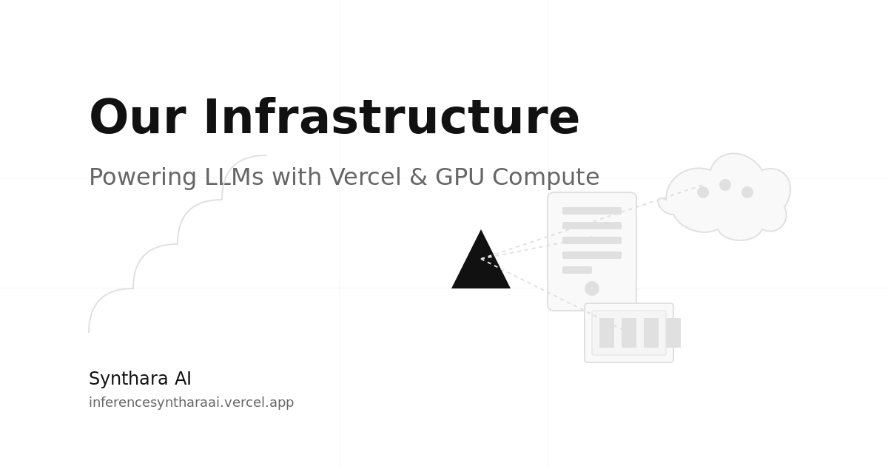

# Synthara Golden



> **IMPORTANT NOTE:** All pages must include Open Graph meta tags with the URL https://inferencesyntharaai.vercel.app and appropriate images for social sharing. The floating pad links should consistently use https://syntharaai.vercel.app.

## Web Application Generator Agent
A software agent that generates web applications from text prompts using Together AI's Llama-3.3-70B model to create HTML, CSS, and JavaScript code.
## Features

Generates web applications from text descriptions
Produces HTML, CSS, and JavaScript code
Supports website previews
Offers web and command-line interfaces

## Installation

Clone the repository.
Install dependencies:

```
pip install -r requirements.txt
```

Configure environment variables:

```
python run.py --setup-env
```

Edit the .env file with your Together API key:
```
TOGETHER_API_KEY=your_api_key_here
```

Obtain an API key from Together AI.
## Usage
### Web Interface
Run:
```
python run.py --web
```

Access at http://localhost:5000 (or the port in .env).
### Command-Line Interface
Run:
```
python run.py "Your web application description" --name project_name --preview
```

Options:

- `--name`: Project name (default: "my_webapp")
- `--preview`: Previews the generated application
- `--port`: Overrides preview server port
- `--setup-env`: Edits .env file

## Environment Configuration
Edit .env:
```
TOGETHER_API_KEY=your_api_key_here
FLASK_PORT=5000
FLASK_DEBUG=True
PREVIEW_PORT=8000
```

## Example
Command-line:
```
python run.py "Create a business website with a dashboard to view customer reports and a form to submit new reports" --name business_dashboard --preview
```

Web interface:

1. Run `python run.py`.
2. Enter "business_dashboard" as project name.
3. Input the prompt above.
4. Click "Generate Web App" and "Preview".

## How It Works

Takes a user prompt describing the web application.
Uses Together AI's Llama-3.3-70B to generate HTML, CSS, and JavaScript.
Saves code to the generated directory.
Previews the website in a browser.

## Limitations

Output quality depends on prompt clarity.
Complex features may need manual coding.
Generates only static, client-side websites.
No server-side functionality.

## License
MIT
